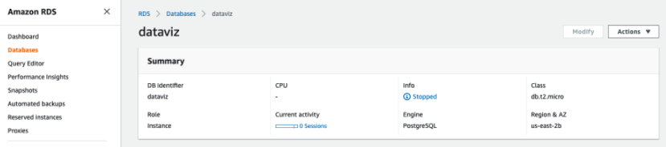
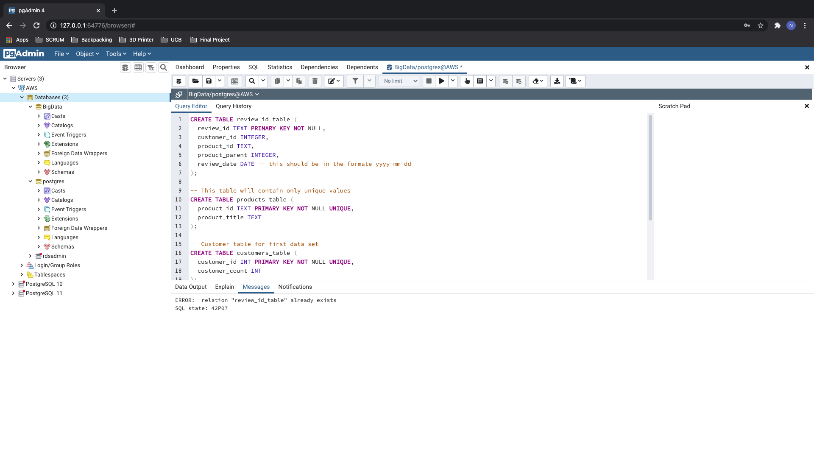
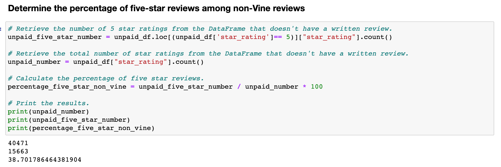
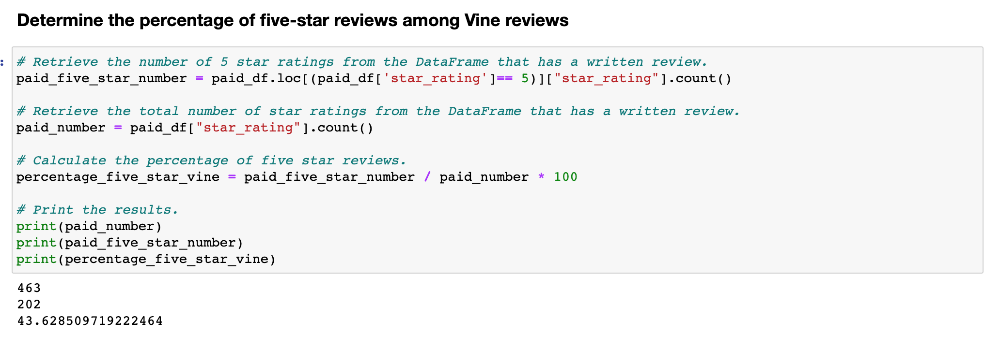

# Amazon_Vine_Analysis

## Overview and Purpose

Task at hand : analyzing Amazon reviews written by members of the paid Amazon Vine program. The Amazon Vine program is a service that allows manufacturers and publishers to receive reviews for their products. Companies like SellBy pay a small fee to Amazon and provide products to Amazon Vine members, who are then required to publish a review. First task at hand will be taking the dataset and using PySpark to perform the ETL process to extract the dataset, transform the data, connect to an AWS RDS instance then load the transformed data into pgAdmin. Nexti chose to use Pandas to determine if there is any bias toward favorable reviews from Vine members in your dataset.

* #### Connecting PostgresSQL database in AWS RDS

* #### Linked to PgAdmin and created the four tables neccesary for dataframes.

## Results: Using bulleted lists and images as support, the learners should address the following questions.

Non Vine Reviews        |  Vine Reviews
:-------------------------:|:-------------------------:
  |  

* How many total reviews were there for a review that was or wasn’t written as part of the Vine program?

  * Total amount of reviews = 40,471 unpaid reviews and 94 paid reviews.
  

* How many 5 star reviews were there for a review that was or wasn’t written as part of the Vine program?
* What is the total percentage of 5 star reviews for or a review that was or wasn’t written as part of the Vine program?

## Summary: In the summary, the learners should state whether there is any bias in the Vine program. They should use the results of their analysis to support their statement, and provide one additional analysis that they could do with the dataset to support their statement.
