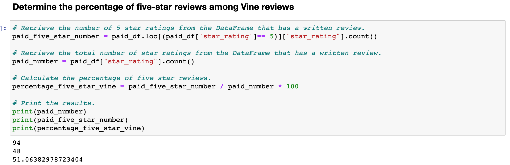

# Amazon_Vine_Analysis

## Overview and Purpose

Task at hand : Analyzing Amazon reviews written by members of the paid Amazon Vine program. The Amazon Vine program is a service that allows manufacturers and publishers to receive reviews for their products. First task at hand will be to Perform ETL on Amazon Product Reviews by using PySpark to read id the data from the csv then going on to pg admin in order to connect it to the amazon database. After this is completed we will then Determine Bias of Vine Reviews by using Pandas in order to read in the data and transform it into results.

## Results and Analysis

Non Vine Reviews        |  Vine Reviews
:-------------------------:|:-------------------------:
  |  

* How many total reviews were there for a review that was or wasn’t written as part of the Vine program?

  * Total amount of reviews = 40,471 non-vine (not paid) reviews and 94 vine (paid) reviews.
  
* How many 5 star reviews were there for a review that was or wasn’t written as part of the Vine program?

  * Total amount of 5 star reviews = 15,663 non-vine (not paid) reviews and 48 vine (paid) reviews.
  
* What is the total percentage of 5 star reviews for or a review that was or wasn’t written as part of the Vine program?

  * Total percentage of 5 star reviews = 38.7% non-vine (not paid) reviews and 51.1% vine (paid) reviews.

## Summary: 

This data suggests that there is a bias toward five-star reviews from paid-reviewers. Reason being is because while the majority of reviews and amount of five star reviews are in favor of non-vine members. It still shows that more than half of vine members reviews are 5 star. That in itself shows bias that paid viewers have. 
A way to have made this unbias would have been further analysis of more samples and knowing how many 1-4 star reviews each viewer left therefore you could see a clear pattern.
